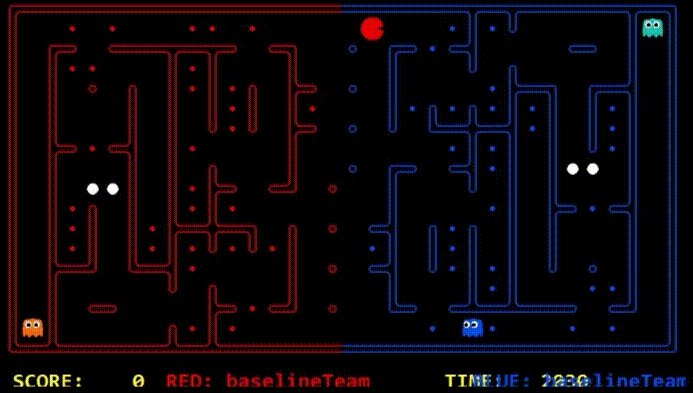
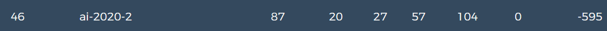

# Evolution of the approach

You can include screenshots of precompetition results and animated gifs, to showcase the evolution of your agents.

## First Agent Team - Heuristic Offensive and Defensive Agents
----

The first team composition we tried out were 2 heuristic agents that used expectimax adversarial search. One agent was tasked with travelling to the opponent's end of the board and collecting food, the other was tasked with standing guard at the border of our end of the board, and chasing down enemy agents that made it past the border.

### Demo

#### Competition results: Position - 46/53 | No staff teams beaten

#### Strategy summary

| Pros | Cons |
|-----------------|:-------------|
| First body part | Second cell  |
| Second line     | foo          |
----
## My Second Agent - Approach fOO
----

Lorem ipsum dolor sit amet, consectetur adipiscing elit, sed do eiusmod tempor incididunt ut labore et dolore magna aliqua. Ut enim ad minim veniam, quis nostrud exercitation ullamco laboris nisi ut aliquip ex ea commodo consequat. Duis aute irure dolor in reprehenderit in voluptate velit esse cillum dolore eu fugiat nulla pariatur. Excepteur sint occaecat cupidatat non proident, sunt in culpa qui officia deserunt mollit anim id est laborum.
### Demo

#### Competition results: Position - 21/37 | Percentile - 57%

#### Strategy summary

| Pros | Cons |
|-----------------|:-------------|
| First body part | Second cell  |
| Second line     | foo          |
