# Evolution of the approach
# Table of Contents
- [First Evolution: Expectimax Offense and Defense Agents](#first-agent-team---Expectimax-Offense-and-Defense-Agents)
- [Second Evolution: Expectimax Offense Agents](#second-agent-team---Expectimax-Offense-Agents)
- [Third Evolution: Improved Expectimax Offense and Defense Agents](#third-agent-team---Improved-Expectimax-Offense-and-Defense-Agents)
- [Fourth Evolution: Monte Carlo Technique Offense and Defense Agents](#fourth-agent-team---Monte-Carlo-Technique-Offense-and-Defense-Agents)
- [Final Evolution: Improved Monte Carlo Techniques and Action Functions for Offense and Defense Agents](#final-agent-team---Improved-Monte-Carlo-Techniques-and-Action-Functions-for-Offense-and-Defense-Agents)

## First Agent Team - Expectimax Offense and Defense Agents
----
#### Strategy summary
The first team composition we tried out were 2 heuristic agents that used expectimax adversarial search. One agent was tasked with travelling to the opponent's end of the board and collecting food, the other was tasked with standing guard at the border of our end of the board, and chasing down enemy agents that made it past the border.

### Demo

*1. Both agents chasing after the same opponent*

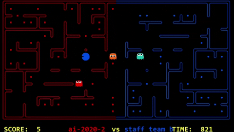

*2. Both agents stuck in the same loop*

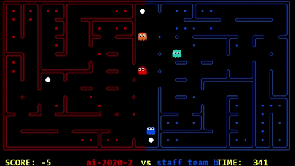 

*3. Offense agent giving power pellets little value*

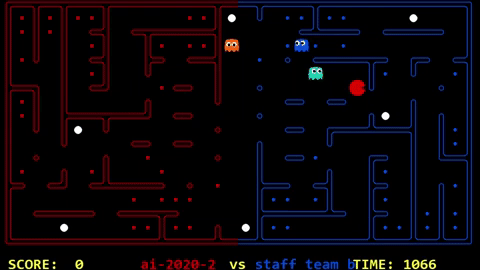

#### Competition: Daily (27/09 3:19am)
#### Results: Position - 38/53 | No staff teams beaten

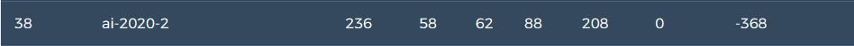

#### Results summary
We only managed to beat staff_team_basic once, and every other staff team match was lost. We were 2 places beneath staff_team_basic on the leaderboard, so ultimately there needed to be a lot more work done to make the agents perform better.

| Pros | Cons |
|-----------------|:-------------|
| Good start, was able to beat some teams | Not smart in choosing targets to chase between both agents |
| | Was easily confused, getting stuck in loops |
| | Didn't make very good use of power pellets |

[Back to top](#table-of-contents)

----
## Second Agent Team - Expectimax Offense Agents
----
#### Strategy summary
We learnt through some testing and observing other teams that having multiple offensive agents was a good choice. We took our original offensive agent and tweaked it further so that it would patrol different regions of the board to cover the most distance.

### Demo

*1. Ghosts keeping their distance from Pacman*

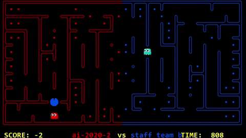

*2. Ghosts trap Pacman, but are stuck and refuse to eat him*

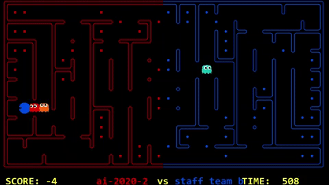

#### Competition: Preliminary
#### Results: Position - 59/69 | No staff teams beaten

![Leaderboard(images/prelim_leaderboard.png)

#### Results summary
We were beaten by every staff team, except for one match with staff_team_top, although that was most likely random luck. As the agents would rarely ever eat any opponents due to imbalanced weights and features values, but would still chase them around the board, we would lose a large majority of matches as long as the opponents managed to get at least 1 pellet.

| Pros | Cons |
|-----------------|:-------------|
| No pros for this agent as the code didn't work correctly | Unable to beat staff teams |
| | Didn't eat many pellets |
| | Didn't intentionally eat enemies that were on our side of the board |

[Back to top](#table-of-contents)

----
## Third Agent Team - Improved Expectimax Offense and Defense Agents
----
#### Strategy summary
The weights of the features were altered to try and encourage eating food, and the defense agent was improved in general

### Demo

*1. Offensive agent still makes some poor decisions*

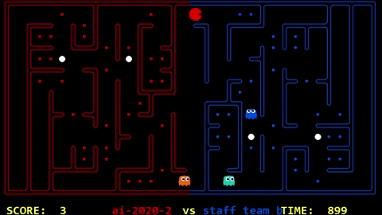

*2. Defensive agent is able to defend quite well*

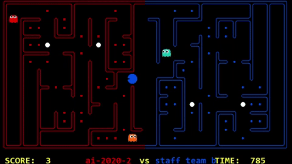

#### Competition: Daily Split (14/10)
#### Results: Position - 19/24 | staff_team_basic defeated

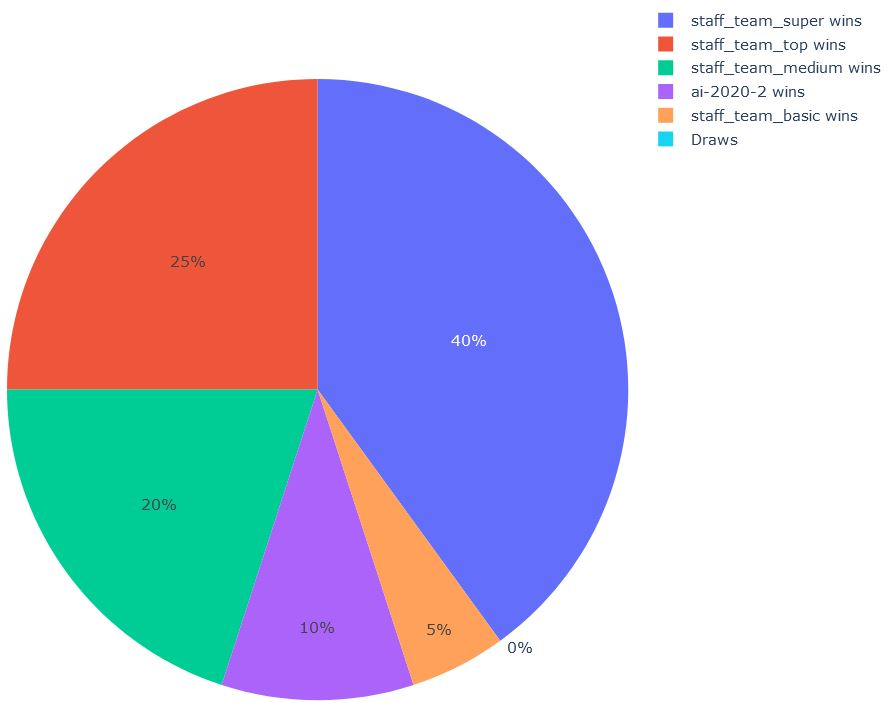

#### Results summary
The team worked a bit better than earlier submissions, especially the defense agent. However, the results show that we still weren't doing well enough to beat staff_team_medium.

| Pros | Cons |
|-----------------|:-------------|
| Defense agent worked very effectively | Offense agent made bad choices |
| The team managed to actually eat food and enemies |  |

[Back to top](#table-of-contents)

----
## Fourth Agent Team - Monte Carlo Technique Offense and Defense Agents
----
#### Strategy summary
We weren't getting desirable results just using expectimax agents, so after spending some time working on an agent team that uses MCT, we tested it out in a daily competition.

### Demo

*1. Defense agent patrols the border with might*

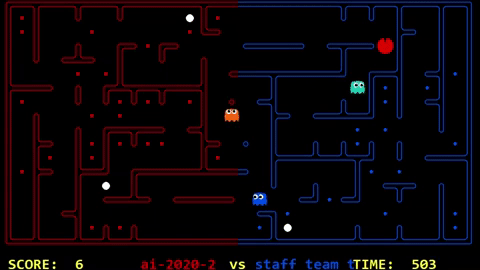

*2. A mistake from the offensive agent costs us the game*

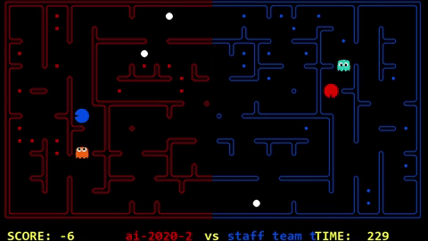

*3. Offensive agent uses power pellets to their maximum potential*

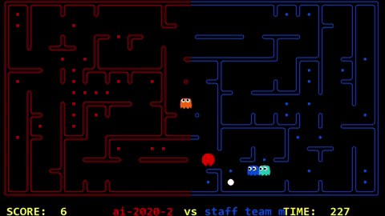

#### Competition: Daily (16/10)
#### Results: Position - 22/67 | staff_team_medium beaten

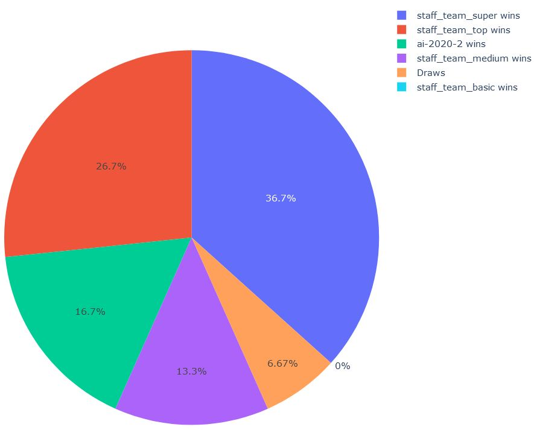

#### Results summary
The results we got were very impressive. We were only 4 spots from taking over staff_team_top, which was a big jump from the results we were getting from the expectimax agents however refinements needs to be done due to pacman occasionally still exerting some 'dumb' behaviour.

| Pros | Cons |
|-----------------|:-------------|
| A great improvement from all other iterations | Still some minor decision making problems |
| Finally uses power pellets to their advantage |  |

[Back to top](#table-of-contents)

----
## Final Agent Team - Improved Monte Carlo Techniques and Action Functions for Offense and Defense Agents
----
#### Strategy summary
The code has been refactored, and multiple action functions have been added, rather than just having one 'chooseAction' method to allow for multiple strategies to be used.
### Demo

*1. Defense agent goes on a wild goose chase*

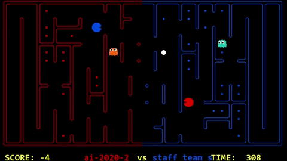

*2. Offense agent is confused by all its options*

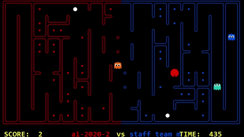

#### Competition: Daily (18/10)
#### Results: Position - 25/70 | staff_team_top beaten

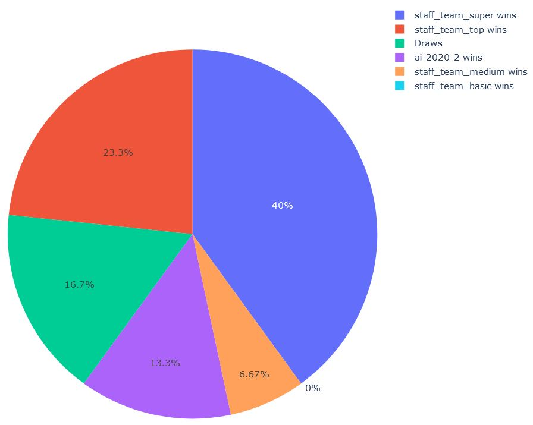

#### Results summary
The first time we were able to beat staff_team_top on the leaderboards, however the agent crashes due to timing out in some games. This may become an issue in competitions that have a large number of games in total, especially if the agent crashes in a match that we were very likely going to win.

| Pros | Cons |
|-----------------|:-------------|
| Ultimately a good agent as a final result| Still some minor decision making problems |
|  | Agent sometimes crashes from taking too long during a turn |

[Back to top](#table-of-contents)