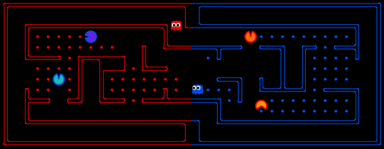

# Pacman Capture the Flag Project Template

You must read fully and carefully the assignment specification and instructions detailed in this file. You are NOT to modify this file in any way.

* **Course:** [COSC1125/1127 Artificial Intelligence](http://www1.rmit.edu.au/courses/004123) @ Semester 2, 2020
* **Instructor:** Prof. Sebastian Sardina
* **Deadline Preliminary Submission:** Sunday September 27rd, 2020 @ 11:59pm (end of Week 9)
* **Deadline Final Submission:** Sunday October 18th, 2020 @ 11:59pm (end of Week 12)
* **Course Weight:** 10% (preliminary) + 30% (final)
* **Assignment type:**: Groups of 3 or 4 (or 2 in some cases)
* **CLOs covered:** 1-6
* **Submission method:** via git tagging (see below for instructions)

The purpose of this project is to implement a Pacman Autonomous Agent that can play and compete in the RMIT AI20 _Pacman Capture the Flag tournament_:

 
 
    
    
 

 
Note that the Pacman tournament has different rules as it is a game of two teams, where your Pacmans become ghosts in certain areas of the grid. Please read carefully the rules of the Pacman tournament. Understanding it well and designing a controller for it is part of the expectations for this project. Additional technical information on the contest project can be found in file [CONTEST.md](CONTEST.md). 

### Table of contents

  * [1. Your task](#1-your-task)
     * [Important basic rules](#important-basic-rules)
  * [2. Deliverables and submission](#2-deliverables-and-submission)
     * [Preliminary submission](#preliminary-submission)
     * [Final submission](#final-submission)
     * [Video (after Week 12)](#video-after-week-12)
  * [3. Pre-contest feedback tournaments](#3-pre-contest-feedback-tournaments)
  * [4. Marking criteria](#4-marking-criteria)
  * [5. Inter-University Competition](#5-inter-university-competition)
  * [6. Important information](#6-important-information)
     * [Corrections:](#corrections)
     * [Late submissions &amp; extensions:](#late-submissions--extensions)
     * [About this repo:](#about-this-repo)
     * [Academic Dishonesty:](#academic-dishonesty)
  * [7. AI20 Code of Honour &amp; Fair Play](#7-ai20-code-of-honour--fair-play)
  * [8. Conclusion](#8-conclusion)
     * [Acknowledgements](#acknowledgements)

## 1. Your task

This is a **group project** of 3 or 4 members (2 in some special cases). Now that you have a repo, the next thing to do is to register your team in the [Project Contest Team Registration Form](https://bit.ly/32gPYAD) and tell the other students to join the team in GitHub Classroom. 

**Your task** is to develop an autonomous Pacman agent team to play the [Pacman Capture the Flag Contest](http://ai.berkeley.edu/contest.html) by suitably modifying file `myTeam.py` (and maybe some other auxiliarly files you may implement). The code submitted should be internally commented at high standards and be error-free and _never crash_. 

In your solution, you have to use at **least 2 AI-related techniques** (**3 techniques at least for groups of 4**) that have been discussed in the subject or explored by you independently, and you can combine them in any form. Some candidate techniques that you may consider are:

1. Heuristic Search Algorithms (using general or Pacman specific heuristic functions).
2. Classical Planning (PDDL and calling a classical planner).
3. Value Iteration (Model-Based MDP).
4. Monte Carlo Tree Search or UCT (Model-Free MDP).
5. Reinforcement Learning – classical, approximate or deep Q-learning (Model-Free MDP).
6. Goal Recognition techniques (to infer intentions of opponents).
7. Game Theoretic Methods.

You can always use hand coded decision trees to express behaviour specific to Pacman, but they won't count as a required technique. You are allowed to express domain knowledge, but remember that we are interested in "autonomy", and hence using techniques that generalise well. The 7 techniques mentioned above can cope with different rules much easier than any decision tree (if-else rules). If you decide to compute a policy, you can save it into a file and load it at the beginning of the game, as you have 15 seconds before every game to perform any pre-computation.

Together with your actual code solution, you will need to develop a Wiki, documenting and describing your solution (a 5-min recorded video will also be required later on, see below).
 
### Important basic rules 

When submitting a solution, please make absolutely sure you adhere to the following rules:

* Your code **must run _error-free_ on Python 3.6**. Staff will not debug/fix any code. If your code crashes in any execution, it will be disqualified from the contest.
    * You can install Python 3.6 from the [official site](https://www.python.org/dev/peps/pep-0494/), or set up a [Conda environment](https://www.freecodecamp.org/news/why-you-need-python-environments-and-how-to-manage-them-with-conda-85f155f4353c/) or an environment with [PIP+virtualenv](https://uoa-eresearch.github.io/eresearch-cookbook/recipe/2014/11/26/python-virtual-env/). See also [this question in the FAQ](https://github.com/RMIT-COSC1127-1125-AI/AI20-DOC/blob/master/FAQ-PACMAN.md#how-do-i-setup-a-system-in-windows-with-python-36).

* Your code **must not contain any personal information**, like your student number or your name. That info should go in the [TEAM.md](TEAM.md) file, as per instructions below. If you use an IDE that inserts your name, student number, or username, you should disable that.

* You are **not to change or affect (e.g., redirect) the standard output or error channels** (`sys.stdout` and `sys.stderr`) beyond just printing on standard output. If your file mentions any of them it will be breaking the "fair play" of the course (see below). These are used to report each game output and errors, and they should not be altered as you will be interfering negatively with the contest and with the other team's printouts. 

* Being a group assignment, you must **use your project Github** repository and GitHub team to collaborate among the members. The group will have write access to the same repository, and also be members of a GitHub team, where members can, and are expected to, engage in discussions and collaboration. Refer to the marking criteria below. 

## 2. Deliverables and submission

There will be two code submissions for this project, and one video report. 

### Preliminary submission

In the **preliminary submission** (Week 9), you are to:
 
1. Submit your first working version of your solution, by tagging the commit as "`preliminary`". 
2. Fill the [Project Certification \& Contribution Form (PRELIMINARY)](https://bit.ly/3hoGZnn).
    * Each member of the team should fill a separate certification form. Members who do not certify will not be marked and will be awarded zero marks.

### Final submission

In the **final submission** (Week 12) you are to submit your final submission to the project, which includes:

1. The `myTeam.py` implementing your AI-based Pacman agent team as per instructions above by tagging the relevant commit as "`submission`". 
2. A completed [TEAM.md](TEAM.md) file, with all the team member details. 
3. A Wiki in your GitHub team repository, documenting and critically analysing your Pacman agent system. 
    * At the very minimum the Wiki should describe the the approaches implemented, a small table comparing the different agents/techniques you tried showing their performances in several scenarios (briefly the table), and an analysis of the strengths and weaknesses of your solution. For example, you may want to show how the addition of a given technique or improvement affected your system at some important point in the development. 
    * However, you can also discuss other aspects, such as other techniques you experimented with (and why they were not used in the final system), future extensions or improvements on your system, etc.
4. A filled [Project Certification & Contribution Form (FINAL)](https://bit.ly/32h3hkz).
    * Each member of the team should fill a separate certification form. Members who do not certify will not be marked and will be awarded zero marks.

Submit your project substantially before the deadline, preferably one day before. Submitting close to the deadline could be risky and you may fail to submit on time, for example due to loss of Internet connection or server delays. There will be no extensions based on these unforeseen problems. 

### Video (after Week 12)

As part of the final course examination, you will be need to submit a **recorded 5-minute oral presentation** that outlines the theoretical or experimental basis for the design of your agents (i.e. why you did what you did), challenges faced, and what you would do differently if you had
more time. 

Your presentation must end with a live demo of your different implementations, i.e. showing how
the different techniques your tried work. 

The video will be shared with us through an unlisted youtube link in the Wiki of your GitHub repository and via a corresponding form that will be made available in due time (if youtube is not possible, we will accept other submissions).

This exercise assessment will be due at exam period and the exact deadline and course marks (up to 10%) will be provided in due time. 

## 3. Pre-contest feedback tournaments

We will be running **informal tournaments** based on preliminary versions of teams' agents in the weeks before the final project submission. We will start once **five teams** have submitted their preliminary agents by tagging their repos with "`test-submission`".

Participating in these pre-contests will give you **a lot of insights** on how your solution is performing and how to improve it. Results, including replays for every game, will be available only for those teams that have submitted. 

You can re-submit multiple times, and we will just run the version tagged `test-submission`. These tournaments carry no marking at all; they are just designed for continuous feedback for you to  debug and improve your solution! You do not need to certify these versions.

We will try to run these pre-competitions frequently, at least once a day once enough teams are submitting versions.

## 4. Marking criteria

The overall project marks (worth 40% total of the course) are as follows:

| Component | Points | Course Weight |
| ----------| -------| --------------|
| Performance of the preliminary submission     | 25 | 10% |
| Performance of the final submission           | 50 | 20% |
| Quality of Wiki and types of techniques used  | 25 | 10% |
| Total  | 100 | 40% |

In both the preliminary and final submissions, a contest will be ran using many layouts to judge the performance of each team. In the final submission, the top-8 will enter into a playoff series to play quarterfinals, semi-finals and finals, time permitting live in the last day of class or in week 13 in a day specified for that (these final phases will not be part of the marking criteria, just bonus marks). Additional technical details can be found in [CONTEST.MD](CONTEST.md). 

The **performance** of your agent will be evaluated relative to some distinguished agent opponents in the  contest. Distinguished agents, provided by teaching staff, will set reference levels of performance. Points will be given according to final position in the tournament with respect to such reference teams:

| Finishing above | Preliminary Contest | Final Contest |
| ----------| -------| -------|
| `staffTeamBasic`      | 13+ | 13+ |
| `staffTeamMedium`     | 17+ | 24+ |
| `staffTeamTop`        | 22+ | 35+ |
| `staffTeamSuper`      | 25  | 50  |
| Winner of contest     | 1 (bonus) | 2 (bonus) |

The precise number of points will depend how far your agent system is from these reference agents in the contest: the farther an agent is from the base reference agents, the more points it will attract. The only exception is `staffTeamSuper`, any team that finishes above it will earn full points (25 or 50). 

This together with the **quality of the Wiki** for the final submission will determine the points earned out of 75 (25 Wiki + 50 final performance), then finally adjusted as per **individual contribution** and **SE quality practices** (see below) as needed. So, for example:
* To to reach a PASS level (37.5 points out of 75 points), a submission must have a full marks Wiki and an agent performing like `staffTeamBasic`.  
* If an agent finishes between `staffTeamMedium` and `staffTeamTop`, and has a full marks Wiki, then it will score between 49 (25 + 24) and 60 (25 + 35) points (the closer to `staffTeamTop`, the closer to 60).

Overall, _assuming a full marks perfect Wiki report_, the `staffTeamBasic` corresponds to a just "pass" (50%), the `staffTeamMedium` to a CR (65%), the `staffTeamTop` to an HD (80%), and the `staffTeamSuper`  to a full mark 100% ninja pacman agent.

Besides the correctness and performance of your solutions, you must **follow good and professional SE practices**, including good use of git and professional communication during your development such as:

* _Commit early, commit often:_ single or few commits with all the solution or big chunks of it, is not good practice.
* _Use meaningful commit messages:_ as a comment in your code, the message should clearly summarize what the commit is about. Messages like "fix", "work", "commit", "changes" are poor and do not help us understand what was done.
* _Use atomic commits:_ avoid commits doing many things; let alone one commit solving many questions of the project. Each commit should be about one (little but interesting) thing. 
* _Adequate communication in the GitHub team:_ members of the group are expected to communicate, in an adequate and professional way, in the GitHub team created along the repo. For example, you could use GitHub team discussions, use issues and pull requests to track development status, or create project plans in the Wiki. Video and voice chats outside of GitHub are permissible (and encouraged), but text communication should be through the GitHub team where possible.

We will also inspect the **commit history** and **GitHub team** to check for high-quality SE practices and meaningful contributions of members. The results of this check can affect the overall mark of the project and point deductions may be applied when poor SE practices have been used. For example, few commits with a lot of code changes, or no or poor communication in the corresponding GitHub team may result in deductions, even if the performance is perfect. 

## 5. Inter-University Competition

The top teams of the final tournament will be inducted to the [RMIT-UoM Pacman Hall of Fame](https://sites.google.com/view/pacman-capture-hall-fame/) and will qualify to the yearly championship across RMIT and The University of Melbourne, which runs every year with the best teams since 2017 onward (given you grant us permission, of course). This is just "for fun" and will attract no marks, but is something that previous students have stated in their CVs!

## 6. Important information

### Corrections:

From time to time, students or staff find errors (e.g., typos, unclear instructions, etc.) in the assignment specification. In that case, a corrected version of this file will be produced, announced, and distributed for you to commit and push into your repository.  Because of that, you are NOT to modify this file in any way to avoid conflicts.

### Late submissions & extensions:

Late submissions are truly inconvenient for this large assessment, as it involves other team members working for several weeks. Late submissions may not enter into the "official" contest and the team may then not receive feedback on time.  The project is available for 6 weeks, so we teams and each member should plan and start early so as to minimize any unexpected circumstances near the end. Extensions will only be permitted in _exceptional_ circumstances; refer to [this question](https://bit.ly/32WMVji) in the course FAQs. Note that workload and/or heavy load of assignments will not be accepted as exceptional circumstances for an extension (we are not allowed to give any extension beyond Week 12 either). 

### About this repo:

You must ALWAYS keep your fork **private** and **never share it** with anybody in or outside the course, except your teammates, _even after the course is completed_. You are not allowed to make another repository copy outside the provided GitHub Classroom without the written permission of the teaching staff. Please respect the [authors request](http://ai.berkeley.edu/project_instructions.html): 

> **_Please do not distribute or post solutions to any of the projects._**

### Academic Dishonesty:
 
This is an advanced course, so we expect full professionalism and ethical conduct.  Plagiarism is a serious issue. Please **don't let us down and risk our trust**. The staff take academic misconduct very seriously. Sophisticated _plagiarism detection_ software (e.g., [Codequiry](https://codequiry.com/), [Turinitin](https://www.turnitin.com/), etc.) will be used to check your code against other submissions in the class as well as resources available on the web for logical redundancy. These systems are really smart, so just do not risk it and keep professional. We trust you all to submit your own work only; please don't let us down. If you do, we will pursue the strongest consequences available to us according to the **University Academic Integrity policy**. For more information on this see file [Academic Integrity](ACADEMIC_INTEGRITY.md).

**We are here to help!:** We are here to help you! But we don't know you need help unless you tell us. We expect reasonable effort from your side, but if you get stuck or have doubts, please seek help. We will run labs to support these projects, so use them! While you have to be careful to not post spoilers in the forum, you can always ask general questions about the techniques that are required to solve the projects. If in doubt whether a questions is appropriate, post a Private post to the instructors.

**Silence Policy:** A silence policy will take effect **48 hours** before due dates. This means that no question about this assignment will be answered, whether it is asked on the newsgroup, by email, or in person.

## 7. AI20 Code of Honour & Fair Play

We expect every RMIT student taking this course to adhere to the **Code of Honour** under which every learner-student should:

* Submit their own original work.
* Do not share answers with others.
* Report suspected violations.
* Not engage in any other activities that will dishonestly improve their results or dishonestly improve or damage the results of others.

Being a contest, we expect **fair play** of all teams in this project. If you are in doubt of whether something would break the good spirit of the project, you must check with us early, not wait to be discovered. Any behaviour or code providing an unfair advantage or causing harm will be treated very seriously. We trust you, do not let us down and be a fair player.

Unethical behaviour is extremely serious and consequences are painful for everyone. We expect enrolled students/learners to take full **ownership** of your work and **respect** the work of teachers and other students.

## 8. Conclusion

This is the end of the project specification. Remember to also read the [CONTEST.md](CONTEST.md) file containing technical information that will come very useful (including chocolate prizes for the winners!).

If you still have doubts about the project and/or this specification do not hesitate asking in the [Piazza Course Discussion Forum](http://piazza.com/rmit.edu.au/spring2020/cosc11271125/home) and we will try to address it as quickly as we can!

**I very much hope you enjoy this final contest project and learn from it a lot**. 

**GOOD LUCK!**

Sebastian

### Acknowledgements

This is [Pacman Capture the Flag Contest](http://ai.berkeley.edu/contest.html) from the set of [UC Pacman Projects](http://ai.berkeley.edu/project_overview.html).  We are very grateful to UC Berkeley CS188 for developing and sharing their system with us for teaching and learning purposes.
